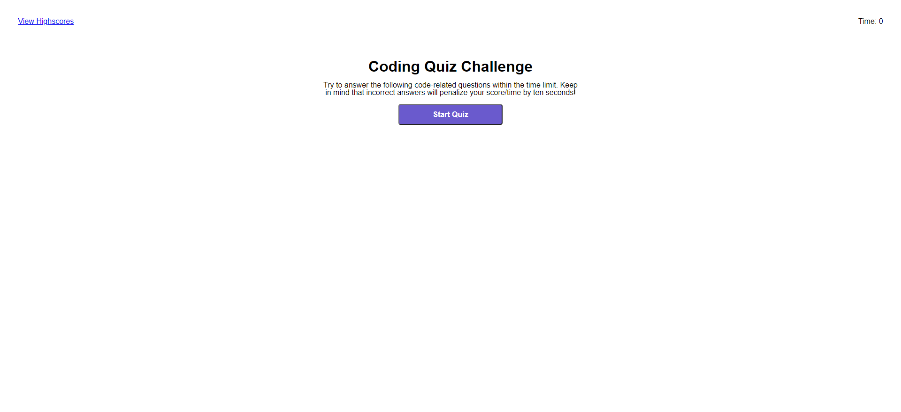

# code-quiz
04 Web APIs: Code Quiz for UW Coding Bootcamp

## description
The project was created for a homework assignment in the UW coding bootcamp. It's a simple 5 question quiz that tests some coding knowledge. It has a 75 second timer to completion. Getting an answer wrong subtracts 10 seconds from the timer. 20 points are awarded for each question answered correctly. At the end of the quiz your points are totaled. You can also enter your intials to be added to the scoreboard. (this last feature is not yet live).

